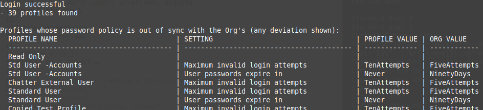

# Salesforce Policy Deviation Checker

Released as open source by NCC Group Plc - https://www.nccgroup.com/

Developed by Jerome Smith ([@exploresecurity](https://twitter.com/exploresecurity))
With thanks to Stephen Tomkinson ([@neonbunny9](https://twitter.com/neonbunny9))

https://www.github.com/nccgroup/SFPolDevChk

Released under AGPL - refer to `LICENSE` for more information.

## Description

Within Salesforce, password policies and session settings set at the top Organization level can be overriden by those at the Profile level. Although this is by design, any changes in these areas within a Profile, even if later reverted to match the Organization settings, cause the Profile to become out of sync with the Organization. In other words, subsequent changes in the password policies and session settings at the Organization level will no longer propagate to these Profiles. Over time, as Profiles are added and copied, this could lead to an accidental misconfiguration for certain sets of users. `SFPolDevChk` reveals which Profiles have become desynchronised in this way, and reviews each one's password policies and session settings to highlight any deviations from those set at the Organization level.

## Usage

Requirements:

* Python 3
* The Python `requests` module (covered by `requirements.txt`)
* A user account with the following minimum permissions:
	* API Enabled
	* View Setup and Configuration
	* Modify Metadata Through Metadata API Functions (see note below)
* The password for this account
* The security token for this account (if coming from an IP address outside any defined Network Access ranges). Refer to <https://help.salesforce.com/articleView?id=user_security_token.htm&type=5> for more information.

Create a JSON config file (so that credentials are not left within the console history):

```
{
	"hostname": "somewhere.my.salesforce.com",
    "username": "",
	"password": "",
	"token": "<optional token>"
	"debug": <optional debug level (0, 1 or 2)>
}
```

Then run:

```
git clone https://github.com/nccgroup/SFPolDevChk
pip install -r requirements.txt
python3 sfpoldevchk.py <config_file>
```

## Output



In the above example, the row for the Profile 'Read Only' is otherwise empty. This is because the password policy for this Profile was, at that time, the same as the policy set for the Organization. However, should the Organization settings change, users assigned to this Profile would not automatically pick up the revised password policy (running the tool again would then highlight the differences).

## Notes

* Only settings that can be controlled through the user-interface are checked.
* No judgment is made on whether deviations from the Organization settings are more or less secure - all differences are reported.

### Account permissions

This tool performs read-only operations. It might therefore be surprising to see '*Modify* Metadata Through Metadata API Functions' as a requirement for the account used to run the tool. However, at the time of writing, it does not appear possible to configure an account with read-only permissions to the Metadata API. From <https://developer.salesforce.com/docs/atlas.en-us.226.0.api_meta.meta/api_meta/meta_quickstart_prereqs.htm>:

> Identify a user that has the API Enabled permission and the Modify Metadata Through Metadata API Functions permission or Modify All Data permission. These permissions are required to access Metadata API calls.
> If a user requires access to metadata but not to data, enable the Modify Metadata Through Metadata API Functions permission. Otherwise, enable the Modify All Data permission.

It therefore appeared preferable to use 'Modify Metadata Through Metadata API Functions' as a minimum requirement over 'Modify All Data'. (Out of interest, a test case was run using '*View* All Data' - it failed.)